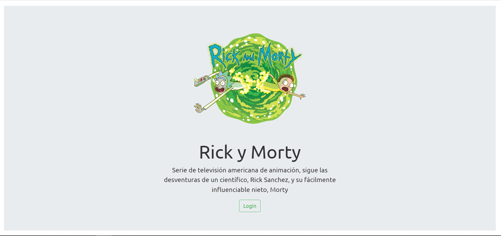
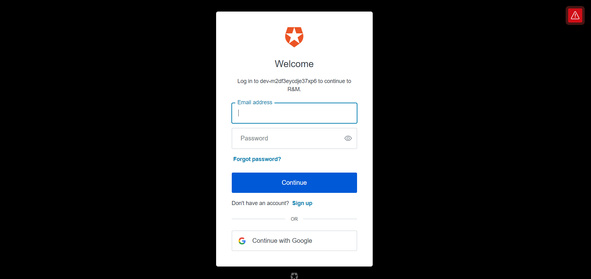
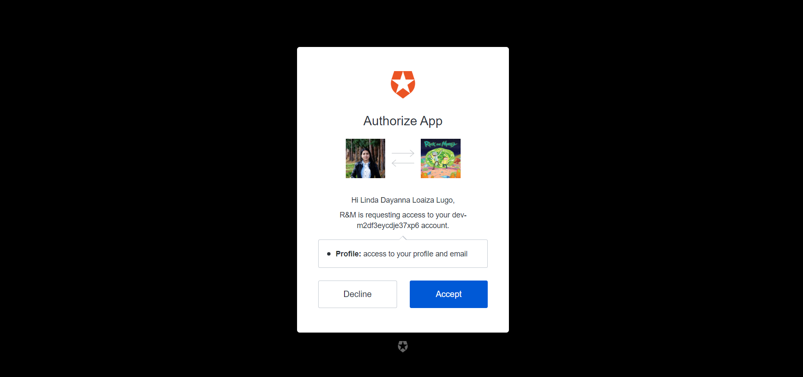
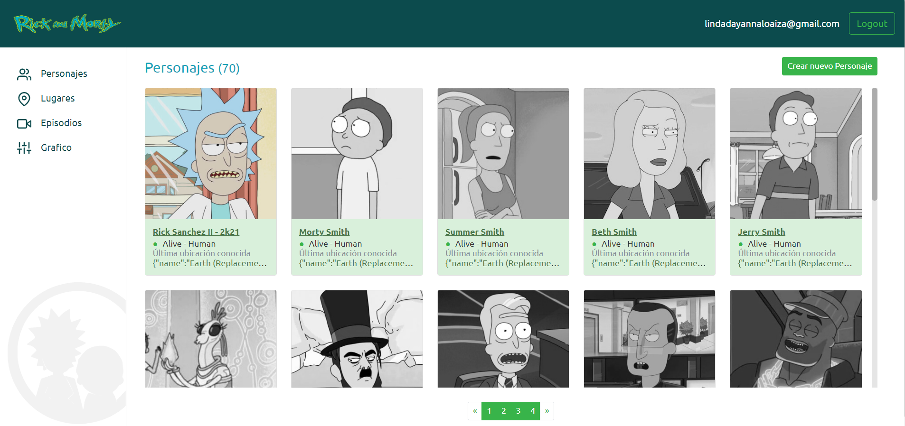
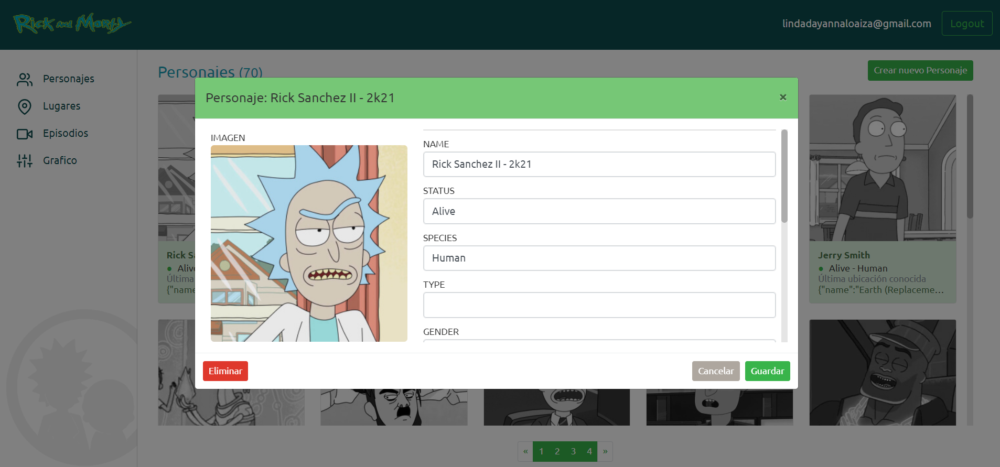
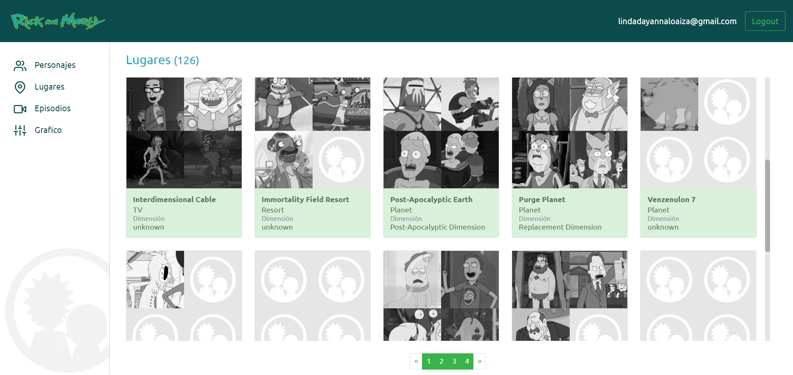
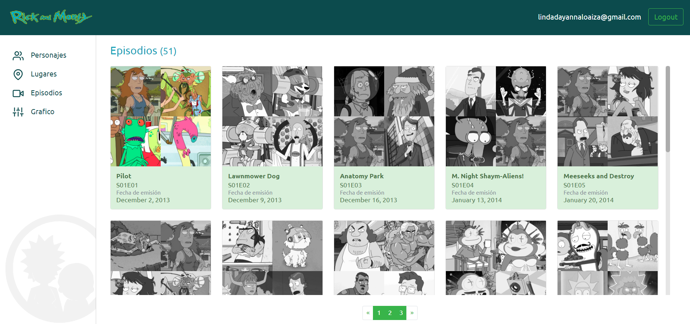
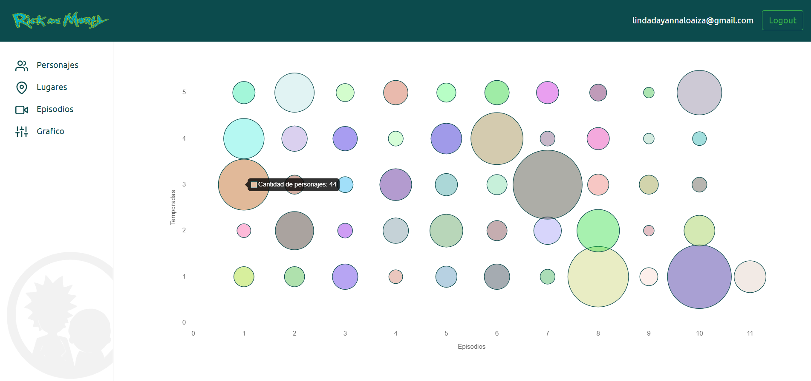

# Explorador de API de Rick & Morty
Aplicación web desarrollada fullstack en Javascript (Node.JS y React) que implementa la API pública de Rick y Morty y agrega ejemplos de gráficos de JavaScript, autenticación(Login, Logout), usabilidad, navegación, consulta y gestión CRUD.

Se utilizó una arquitecura Cliente / Servidor básica con un desarrollo basado en componentes CDD.

## INSTALACION
- git clone rym_app
- cd rym_app

- ### FRONTEND
    - cd ./client
    - npm install

- ### BACKEND
    - cd ./server
    - npm install

## COMPILACIÓN FRONTEND
- Para compilar React (cuando haya sido modificado) se debe ejecutar npm run build en ./client

## EJECUCION
- ### FRONTEND
    - cd ./client
    - npm run start:dev

- ### BACKEND
    - cd ./server
    - npm run start:dev

## STACK UTILIZADO
- Node JS
- Webpack
- React JS
- React Router
- Bootstrap
- Bootswatch
- SQLite
- Git y npm
- AUTH0
- chart.js

##  AUTENTICACIÓN
En primer lugar se realiza Login y Registro con AUTH0. Auth0 es una plataforma que permite agregar funciones de autenticación y autorización a las aplicaciones, permite iniciar sesión con correo electrónico y contraseña, o con proveedores de redes sociales como Google.

##  LISTADO DE PERSONAJES, LUGARES Y EPISODIOS
Consume la API de https://rickandmortyapi.com/api

##  GRAFICO
Se creo la pagina 'Gráfico' donde se puede ver la cantidad de personajes que salen en cada episodio de acuerdo a la temporada. El gráfico se realizo con chart.js.

## FEATURES
- Consume la API de RyM online a través del backend propio
- El backend expone API para manejo de CRUD de personajes
- La entidad personajes existe localmente en una base de datos SQLite
- Se incluyó TOKEN para consumo de API
- Se incluyó CRUD en frontend para personajes
- Se agregó personalización por tema Bootswatch intercambiable en index.html

## KNOWN ISSUES
- Persiste el estado de los datos en el Modal de lectura individual
- Al Abrir por primera vez el detalle de una entidad sus datos persisten en las subsiguientes, al hacer F5 y consultar otra entidad por primera vez, son estos nuevos datos los que persisten
- Al seleccionar una imagen en crear nuevo personaje, se borran los datos creados con Dummy 
- Al crear un nuevo personaje y cerrar el diálogo modal, y volver para crear uno nuevo, los datos anteriores persisten
- Al crear, modificar o eliminar un personaje, y cerrar el diálogo modal, no se está refrescando la vista del listado general, por lo que hay que cambiar de página y volver, o simplemente hacer click en la paginación de la misma página
- Al navegar entre páginas o secciones, persiste la posición del scroll de contenido
